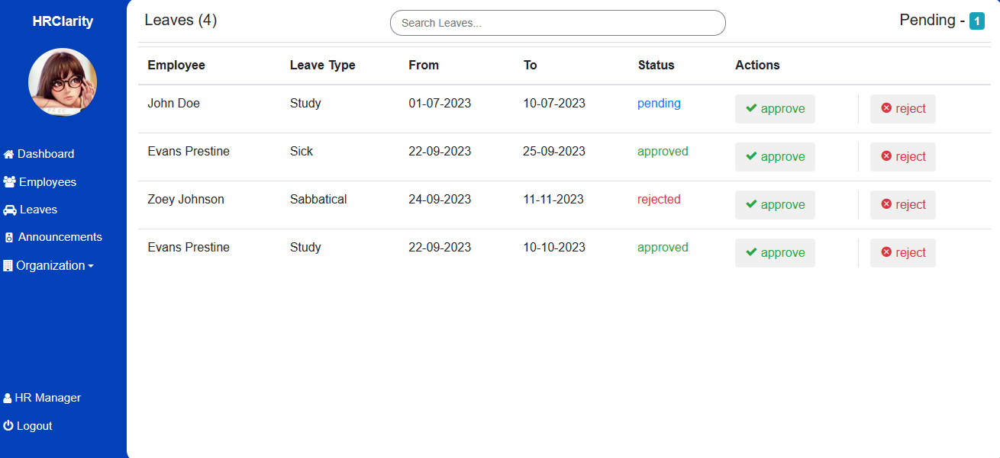
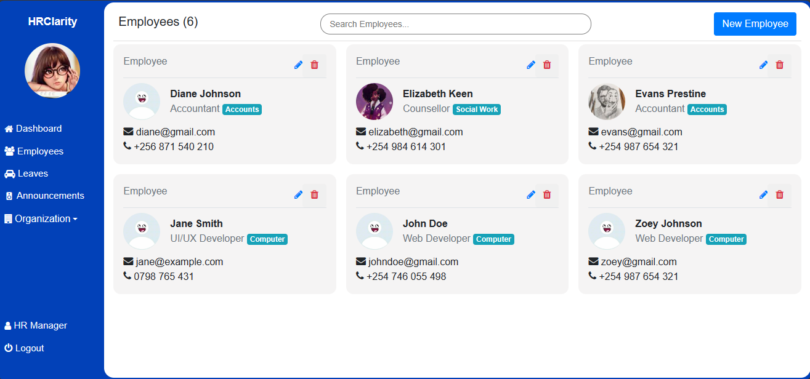
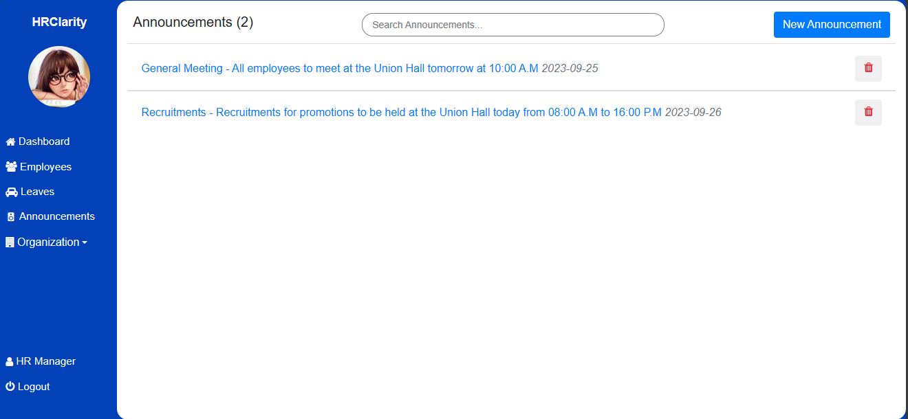

# HRClarity

<p>HRClarity is a Human Resource Management System.</p>
<p>To view the deployed project, visit <a href="https://hrclarity.onrender.com/">hrclarity.onrender.com</a></p>
<p>To view the Linkedin article, visit <a href="">Linkedin article</a></p>
<p>You can also connect with the author on Linkedin: <a href="https://www.linkedin.com/in/alexwambui/" target="_blank">AlexWambui</a></p>
<p>It enables Human Resource Managers perform tasks such as:</p>

- handling leaves.

- maintaining records of employees such as promotions, change of occupations and firing.

- making announcements.


<p>the employees in the organization can be able to:</p>

- update their user accounts.
- view announcements made by the HR.
- apply for leaves.

# Installation
- Ensure you're using the latest version of Python
- Clone the repository
- run the following command to install required dependencies:
```
pip install -r requirements.txt
```
- create a .env file with variables as shown below:
`SECRET_KEY=your_secretkey
SQLALCHEMY_DATABASE_URI=dbURI_example:- sqlite:///hrms.db`

# Usage
- xxx

# Contributing
<p>The developer works tirelessly to improve and develop HRClarity. If you enjoy using the software, please consider donating to the developer, so he can spend more time implementing improvements. You can also contribute by getting involed with the source code.</p>

## For devs
- Fork the repo
- play with it
- make pull requests

## For end-users
- Report bugs
- Suggest new features
- Be patient

# Built with
- HTML, Bootstrap, Sass, Jinja - The User Interface.
- Python (Flask) - Backend.
- Sqlite3 - Database.


# Upcoming Features
- Chat for HRs to get feedback from employees.
- Email notifications for both HRs and employees.